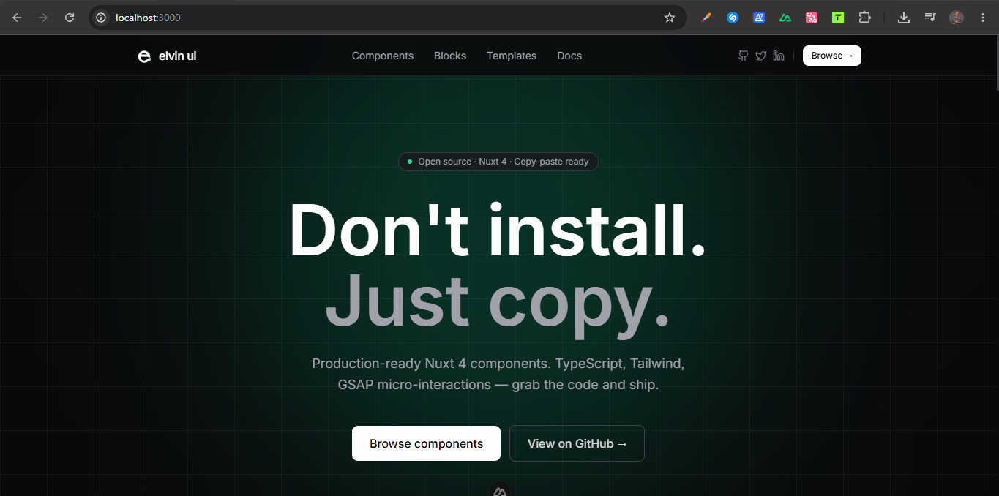

<p align="center">
  
</p>

<h1 align="center">Elvin UI</h1>

<p align="center">
  Beautiful, production-ready UI components and templates for Nuxt 4.<br />
  Copy, paste, ship. No CLI. No config. No hidden dependencies.
</p>

<p align="center">
  <a href="https://elvin-ui.com">elvin-ui.com</a>
  &nbsp;·&nbsp;
  <a href="https://elvin-ui.com/components">Components</a>
  &nbsp;·&nbsp;
  <a href="https://elvin-ui.com/blocks">Blocks</a>
  &nbsp;·&nbsp;
  <a href="https://elvin-ui.com/templates">Templates</a>
  &nbsp;·&nbsp;
  <a href="https://elvin-ui.com/pricing">Pricing</a>
</p>

<p align="center">
  
  
  
  
  
  
</p>

---

## What is Elvin UI?

Elvin UI is a **Nuxt 4 component and template library built for speed**. Every piece of UI is a standalone `.vue` file you copy directly into your project — no package to install, no CLI to run, no configuration to wrestle with.

It is not an npm package. It is not a design system. It is a curated collection of production-quality UI patterns that you own the moment you paste them in.

---

## What's included

| | Free | Blocks Pack | Full Access |
|---|:---:|:---:|:---:|
| **26 UI components** (Button, Input, Modal, Badge…) | ✓ | ✓ | ✓ |
| Full source code + TypeScript | ✓ | ✓ | ✓ |
| MIT License | ✓ | ✓ | ✓ |
| **24 UI blocks** (Hero, Navbar, Pricing, Footer…) | Preview | ✓ | ✓ |
| GSAP micro-interactions source | — | ✓ | ✓ |
| **24 premium page templates** | — | — | ✓ |
| SaaS, Dashboard, E-commerce, Blog, Finance, Social | — | — | ✓ |
| Future content | — | ✓ | ✓ |
| **Price** | $0 | $39 | $99 |

---

## Stack

| Tool | Role |
|---|---|
| [Nuxt 4](https://nuxt.com) | Framework + routing + auto-imports |
| [Vue 3](https://vuejs.org) | Composition API, `<script setup>` |
| [TypeScript](https://www.typescriptlang.org) | Strict mode throughout |
| [TailwindCSS](https://tailwindcss.com) | All styling — zero custom CSS |
| [GSAP](https://gsap.com) | Micro-interactions only (hover, enter, exit) |
| [Nuxt Icon](https://github.com/nuxt/icon) | Icon system (Lucide) |
| [Cloudflare Workers](https://workers.cloudflare.com) | Edge deployment |

---

## Getting started

### 1. Prerequisites

A Nuxt 4 project with TailwindCSS and GSAP installed.

```bash
# TailwindCSS
npm install -D tailwindcss @nuxtjs/tailwindcss

# GSAP (for animated components)
npm install gsap

# Nuxt Icon (for icon support)
npm install @nuxt/icon
```

### 2. Copy a component

Browse [elvin-ui.com/components](https://elvin-ui.com/components), pick a component, copy the source code, and paste it into your `components/ui/` folder.

```
components/
  ui/
    UiButton.vue       ← paste here
    UiInput.vue
    UiBadge.vue
```

### 3. Use it

No import needed — Nuxt auto-imports components from `components/`.

```vue
<template>
  <UiButton variant="primary" size="md">
    Get started
  </UiButton>
</template>
```

That's it. No registration, no providers, no wrapping.

---

## Project structure

```
app/
  components/
    ui/               → Atomic components (UiButton, UiInput, UiBadge…)
    blocks/           → Composed sections (HeroSection, NavBar, PricingSection…)
  pages/              → Demo & showcase pages
  layouts/            → Default layout, docs layout
  composables/        → Shared logic (useAuth, useProAccess…)
  data/               → Component + block + template metadata
  assets/
    main.css          → Global styles, CSS variables
public/               → Static assets (logo, favicon, OG image)
server/
  api/auth/           → License key validation (Chariow)
  utils/              → Session helpers
```

---

## Component anatomy

Every component follows the same pattern — predictable, copy-paste ready.

```vue
<script setup lang="ts">
// 1. Props (TypeScript)
interface Props {
  variant?: 'primary' | 'secondary' | 'ghost' | 'danger'
  size?: 'sm' | 'md' | 'lg'
  disabled?: boolean
}
const props = withDefaults(defineProps<Props>(), {
  variant: 'primary',
  size: 'md',
})

// 2. Optional GSAP animation
const el = useTemplateRef('el')
onMounted(() => {
  el.value?.addEventListener('mouseenter', () =>
    gsap.to(el.value, { scale: 1.03, duration: 0.2, ease: 'power2.out' })
  )
})
</script>

<template>
  <button ref="el" :class="[...]">
    <slot />
  </button>
</template>
```

---

## Rules

- **TailwindCSS only** — no custom CSS classes, no scoped styles
- **GSAP for micro-interactions only** — hover, enter, exit; no heavy page transitions
- **Self-contained** — each component works without hidden utilities
- **`<script setup>` always** — no Options API
- **SSR-safe** — GSAP and DOM code inside `onMounted`

---

## Running locally

```bash
# Clone
git clone https://github.com/Elvinkyungu/elvin-ui.git
cd elvin-ui

# Install dependencies
npm install

# Copy environment variables
cp .env.example .env
# Fill in CHARIOW_API_KEY and SESSION_SECRET

# Start dev server
npm run dev
```

Open [http://localhost:3000](http://localhost:3000).

---

## Environment variables

| Variable | Required | Description |
|---|:---:|---|
| `CHARIOW_API_KEY` | Production | Validates license keys via Chariow API |
| `SESSION_SECRET` | Production | 32+ char secret for session encryption (AES-256-GCM) |
| `NUXT_PUBLIC_SITE_URL` | Optional | Canonical URL (default: `https://elvin-ui.com`) |

See `.env.example` for details.

---

## Deployment

The project is configured for **Cloudflare Workers** via `nitro.preset = 'cloudflare-module'`.

```bash
npm run build
npx wrangler deploy
```

After deployment, set the `SESSION_SECRET` and `CHARIOW_API_KEY` secrets in your Cloudflare dashboard.

---

## License

UI components (the `app/components/ui/` directory) are released under the **MIT License** — free to use, modify, and distribute in personal and commercial projects.

Block source code and premium templates require a [Blocks Pack or Full Access](https://elvin-ui.com/pricing) license.

---

<p align="center">
  Built by <a href="https://x.com/ElvinKyungu">@ElvinKyungu</a>
  &nbsp;·&nbsp;
  <a href="https://elvin-ui.com">elvin-ui.com</a>
</p>
